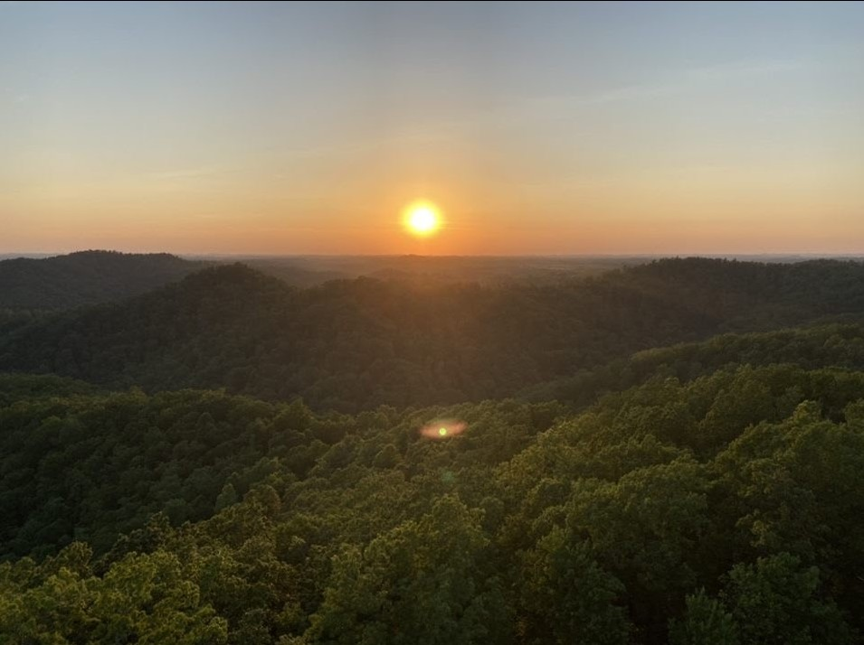
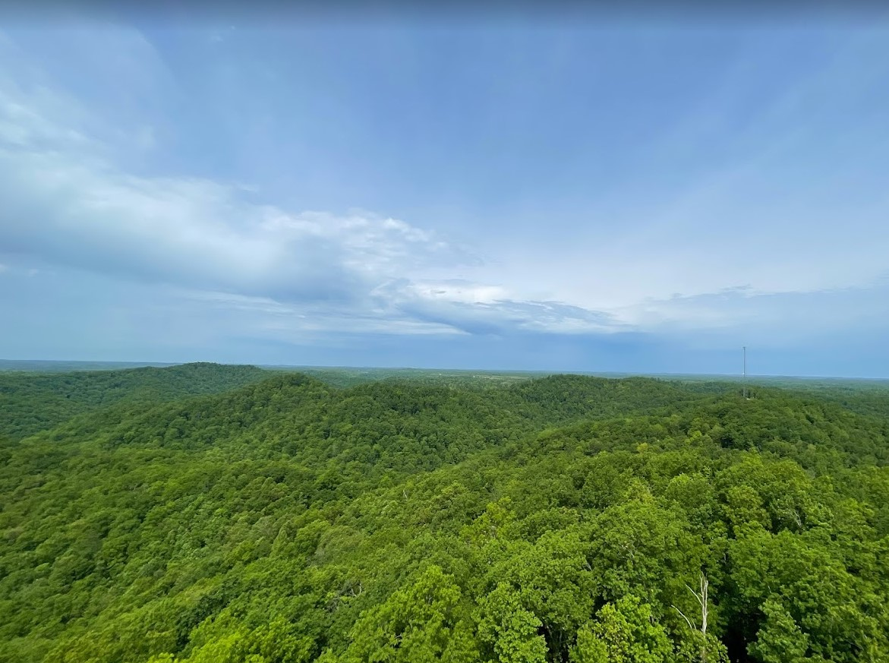
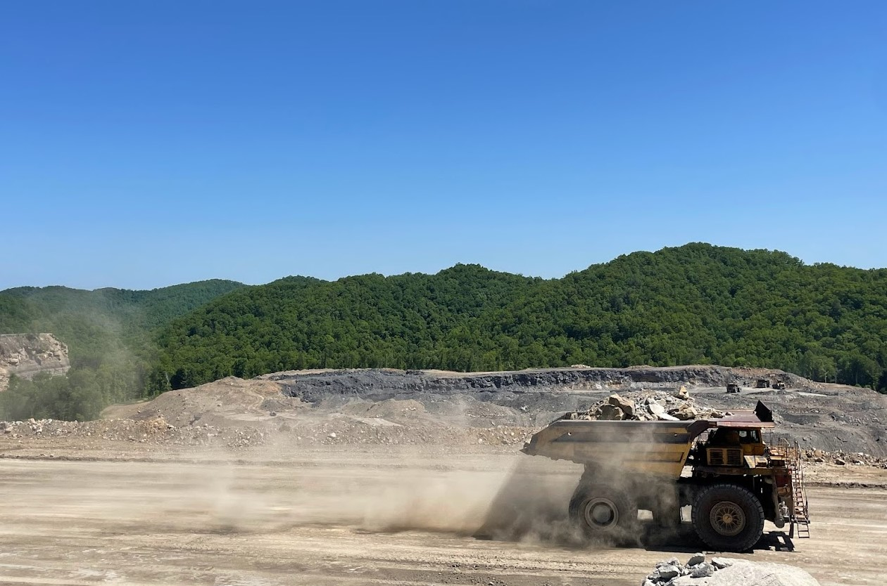
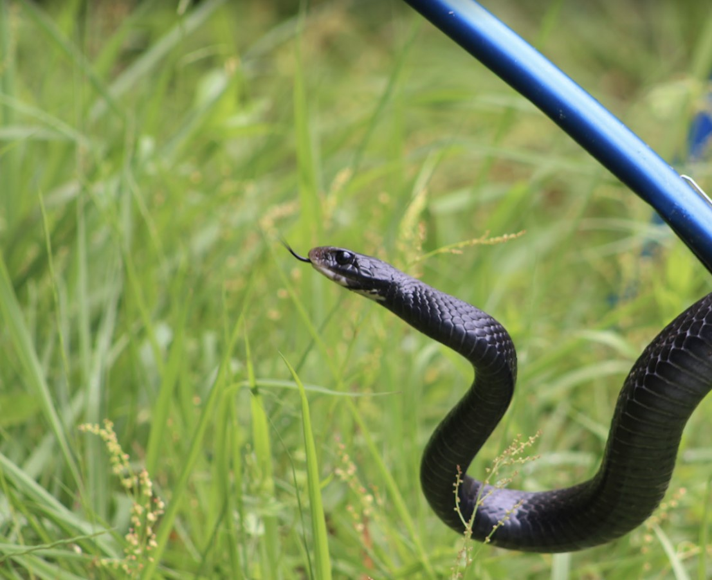

# Robinson-Forest-Shaded-Relief
Robinson Forest Shaded Relief Map, including pictures from nearby

Robinson Forest is located near Clayhole, KY and acts as a hydrologic and ecologic research field facility. There are 23 watersheds that have been monitored for the last 50 years, making it a vital location for researching the impacts climate change has on this freshwater source. The area is under constant pressure from mining nearby, and represents one of the last non-mined sites in the area due to government and university protection. 

     
*RF Shaded Relief*

[Link to high-resolution version](Layout33.pdf)     

 Sunset over the forest: Sam Sapeta

 Wide angle shot of the forest: Sam Sapeta

 Nearby mining activity: Sam Sapeta

 Snake that was tagged by fellow researchers: Sam Sapeta

Sam Sapeta is a NRES student focusing on hydrology and GIS, so the tools used in this project will be very helpful down the line on some of his relevant research he has conducted at Robinson Forest. 
